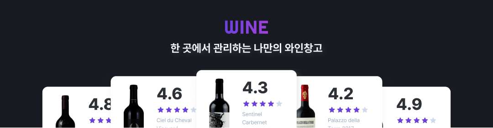

# 🍷 WINE



> 코드잇 스프린트 FE 10기 Part3-2팀 중급 프로젝트 ( 2024.11.14 ~ 2024.12.02 )<br />
> 와인 리뷰 플랫폼 **WINE**

<br />

## 🔗 배포 URL

- [**WINE**](https://codeit-fe10-wine.vercel.app/)

<br />

## 💻 프로젝트 설치

```
git clone https://github.com/jsh1147/codeit-FE10-WINE.git
cd codeit-FE10-WINE
npm install
npx husky
```

<br />

## 👩‍💻 팀원 소개

<div align="center">

|                                  김수영                                  |                                  김태훈                                   |                                  이수지                                  |                               정성현(팀장)                               |
| :----------------------------------------------------------------------: | :-----------------------------------------------------------------------: | :----------------------------------------------------------------------: | :----------------------------------------------------------------------: |
|  |  |  |  |
|                 [@swim-kim](https://github.com/swim-kim)                 |              [@SHAKALOHANA](https://github.com/SHAKALOHANA)               |                [@mulddang2](https://github.com/mulddang2)                |                  [@jsh1147](https://github.com/jsh1147)                  |

</div>

<br />

## 🤝 역할 분담

- **김수영**
  - 내프로필 페이지, 리뷰수정 모달, 와인수정 모달, 삭제 모달
- **김태훈**
  - 상세 페이지, 리뷰등록 모달
- **이수지**
  - 목록 페이지, 와인등록 모달, 필터 모달
  - 전역 CSS
- **정성현**
  - 랜딩 페이지, 회원가입/로그인 페이지
  - 초기 환경 구성, 레이아웃
  - 문서 작업

<br />

## 🛠 기술 스택

- **개발 환경**

  -   

- **빌드 및 배포**

  -   

- **FE 기술**

  -   
  -   

- **품질 관리**

  -   

- **협업 도구**

  -   

<br />

## 🗂️ 프로젝트 구조

```
codeit-FE10-WINE
├─ .github               : GitHub 설정
├─ .husky                : Husky 설정
├─ apis                  : 통신 API
├─ components            : 컴포넌트
│   ├─ common            : 공용 컴포넌트
│   ├─ layout            : 레이아웃 컴포넌트
│   └─ PAGE/COMPO.tsx    : 페이지 컴포넌트
├─ constants             : 전역 상수
├─ hooks                 : 커스텀 훅
├─ pages                 : 페이지 라우팅
│   └─ PAGE/index.tsx    : 페이지
├─ public                : 정적 파일
│   ├─ fonts             : 글꼴
│   ├─ icons             : 아이콘
│   ├─ images            : 이미지
│   └─ meta              : 메타 데이터
├─ store                 : 전역 상태
├─ styles                : 전역 CSS
├─ types                 : 공용 타입
└─ utils                 : 유틸 함수
```
